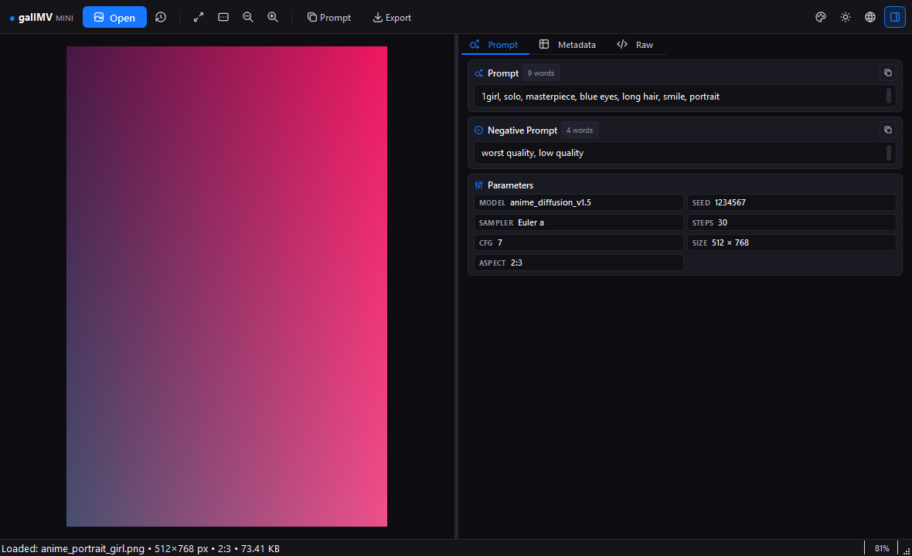

# galIMVmini

<p align="center">
  
  
  
  
  
  
</p>

A desktop image viewer and metadata inspector for AI-generated images. galIMVmini opens local images, parses generation parameters into structured fields, computes aspect ratios, and provides full internationalization across 20 languages.



## Core Capabilities

### Metadata Parsing
- **Stable Diffusion (Automatic1111, WebUI Forge, SD.Next)**: extracts positive and negative prompts, seed, sampler, steps, CFG scale, model checkpoint, hash, denoise strength, and clip skip.
- **Extension Parameters**: detects Forge, TIPO, and ADetailer metadata blocks.
- **ComfyUI**: parses execution graphs, prompt nodes, checkpoints, and latent sampler parameters.
- **Fooocus & NovelAI**: reads embedded JSON generation payloads.
- **Midjourney & EXIF**: extracts camera data, image dimensions, megapixels, and PNG text chunks.
- **Sidecar Files**: reads companion `.txt` files with prompt text; automatically hides the sidecar section when no matching file exists.

### Aspect Ratio Calculation
- Detects standard photo and display ratios: `1:1`, `16:9`, `9:16`, `4:3`, `3:4`, `3:2`, `2:3`, `21:9`, `5:4`.
- Displays ratio badges in the parameters card, window title, and status bar.

### Interface & Design
- **Lobe Theme**: dark (`#18181b`) and light (`#ffffff`) modes with 6 accent colors (Blue, Purple, Emerald, Orange, Rose, Zinc).
- **Tabler Vector Icons**: clean SVG icons rendered at native display resolution without emoji characters.
- **State Persistence**: theme mode, accent color, and active language persist across restarts in a local configuration file.
- **Balanced Layout**: default 50/50 proportion between image canvas and inspector panel with a draggable splitter.
- **Fullscreen View**: toggle with `F11`, exit with `Esc`. Canvas automatically refits the image upon entering or exiting fullscreen mode.

### Supported Languages (20 Locales)
galIMVmini includes built-in translations for:
- English (`en_US`)
- Russian (`ru_RU`)
- Simplified Chinese (`zh_CN`)
- Traditional Chinese (`zh_TW`)
- Japanese (`ja_JP`)
- Korean (`ko_KR`)
- German (`de_DE`)
- French (`fr_FR`)
- Spanish (`es_ES`)
- Portuguese (Brazil) (`pt_BR`)
- Italian (`it_IT`)
- Polish (`pl_PL`)
- Turkish (`tr_TR`)
- Ukrainian (`uk_UA`)
- Dutch (`nl_NL`)
- Indonesian (`id_ID`)
- Vietnamese (`vi_VN`)
- Thai (`th_TH`)
- Arabic (`ar_SA`)
- Hindi (`hi_IN`)

## Keyboard Shortcuts

| Key | Action |
| :--- | :--- |
| `Ctrl + O` | Open image file |
| `Ctrl + H` | Recent files menu |
| `Ctrl + C` | Copy prompt text to clipboard |
| `Ctrl + E` | Export metadata (TXT, Markdown, JSON, CSV) |
| `0` | Fit image to window |
| `1` | Zoom to 100% natural resolution |
| `+` / `-` | Zoom in / Zoom out |
| `Mouse Wheel` | Zoom anchored at cursor position |
| `Left Click + Drag` | Pan canvas |
| `I` | Toggle inspector panel visibility |
| `F11` | Toggle fullscreen mode |
| `Esc` | Exit fullscreen mode |

## Installation & Running

### Requirements
- Python 3.8+
- PyQt6 6.5+
- Pillow 10.0+

### Setup
```bash
git clone https://github.com/your-username/galIMVmini.git
cd galIMVmini
pip install -r requirements.txt
python main.py
```

On Windows, you can also run `run.bat`.

## Building Executables

Create a standalone Windows build with PyInstaller:

```bash
# Directory distribution (faster launch)
python build_exe.py

# Single-file portable executable
python build_exe.py --onefile
```

Build artifacts are placed in the `dist/` directory.

## Project Structure

```
galIMVmini/
├── core/
│   ├── i18n.py          # 20-language translation engine
│   ├── icons.py         # Tabler SVG vector icon repository
│   ├── metadata.py      # AI metadata parser and aspect ratio engine
│   └── theme.py         # Lobe theme palettes and style generator
├── ui/
│   ├── image_canvas.py  # QGraphicsView image canvas with pan and zoom
│   ├── prompt_card.py   # Prompt and parameter inspector
│   ├── metadata_table.py# Structured property table
│   ├── raw_view.py      # Raw metadata and JSON viewer
│   └── main_window.py   # Main window layout and toolbar controls
├── locales/             # Localization JSON files
├── docs/
│   └── screenshots/     # Interface screenshots
├── resources/           # Application icon (app.ico)
├── build_exe.py         # PyInstaller build script
├── build_exe.bat        # Windows build helper
├── main.py              # Application entry point
├── requirements.txt     # Python dependencies
└── LICENSE              # MIT License
```

## License

This project is licensed under the MIT License. See [LICENSE](LICENSE) for details.
