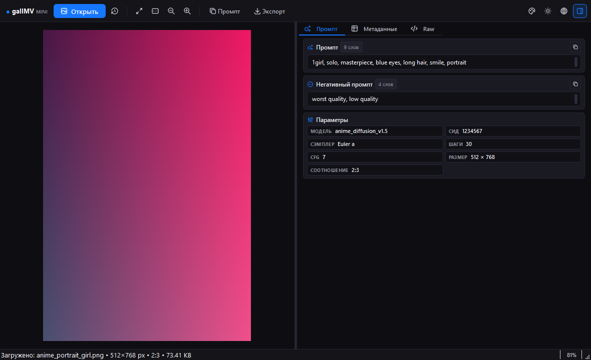
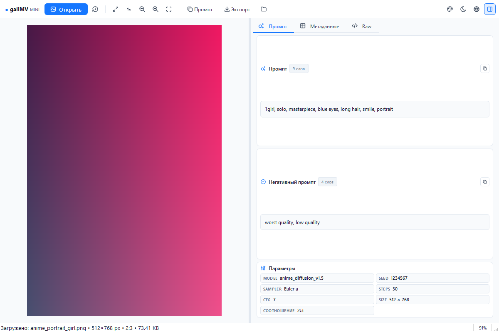

# galIMVmini

Легковесный просмотрщик и инспектор метаданных для изображений, созданных нейросетями. galIMVmini открывает локальные файлы, извлекает параметры генерации в структурированный вид, рассчитывает соотношение сторон и поддерживает 20 языков интерфейса.



## Основные возможности

### Парсинг метаданных
- **Stable Diffusion (Automatic1111, WebUI Forge, SD.Next)**: позитивный и негативный промпты, сид, сэмплер, количество шагов, шкала CFG, чекпоинт модели, хэш, сила денойза и clip skip.
- **Параметры расширений**: извлечение блоков Forge, TIPO и ADetailer.
- **ComfyUI**: разбор графа выполнения, нод промптов, загрузчиков чекпоинтов и параметров латентного сэмплера.
- **Fooocus и NovelAI**: чтение встроенных структур JSON.
- **Midjourney и EXIF**: данные камеры, разрешение, количество мегапикселей и текстовые чанки PNG.
- **Файлы описания (Sidecar)**: чтение связанных `.txt` файлов с текстом генерации; блок автоматически скрывается, если файл отсутствует.

### Расчет соотношения сторон
- Определение стандартных форматов кадра: `1:1`, `16:9`, `9:16`, `4:3`, `3:4`, `3:2`, `2:3`, `21:9`, `5:4`.
- Отображение пропорций в блоке параметров, заголовке окна и строке состояния.

### Интерфейс и оформление
- **Тема Lobe**: темный (`#18181b`) и светлый (`#ffffff`) режимы с 6 акцентными цветами (синий, фиолетовый, изумрудный, оранжевый, розовый, цинк).
- **Векторные иконки Tabler**: четкие SVG-иконки без использования эмодзи.
- **Сохранение параметров**: выбранная тема, цвет акцента и язык сохраняются в конфигурационном файле и восстанавливаются при повторном запуске.
- **Сбалансированная компоновка**: разделение 50/50 между холстом изображения и инспектором с регулировкой сплиттером.
- **Полноэкранный просмотр**: переход по клавише `F11`, выход по `Esc`. Изображение автоматически центрируется и масштабируется под размер экрана.



### Поддерживаемые языки (20 локализаций)
Интерфейс переведен на 20 языков:
- Русский (`ru_RU`)
- Английский (`en_US`)
- Китайский упрощенный (`zh_CN`)
- Китайский традиционный (`zh_TW`)
- Японский (`ja_JP`)
- Корейский (`ko_KR`)
- Немецкий (`de_DE`)
- Французский (`fr_FR`)
- Испанский (`es_ES`)
- Португальский (Бразилия) (`pt_BR`)
- Итальянский (`it_IT`)
- Польский (`pl_PL`)
- Турецкий (`tr_TR`)
- Украинский (`uk_UA`)
- Нидерландский (`nl_NL`)
- Индонезийский (`id_ID`)
- Вьетнамский (`vi_VN`)
- Тайский (`th_TH`)
- Арабский (`ar_SA`)
- Хинди (`hi_IN`)

## Горячие клавиши

| Сочетание | Действие |
| :--- | :--- |
| `Ctrl + O` | Открыть файл изображения |
| `Ctrl + H` | История недавних файлов |
| `Ctrl + C` | Скопировать промпт в буфер обмена |
| `Ctrl + E` | Экспорт метаданных (TXT, Markdown, JSON, CSV) |
| `0` | Вписать изображение в окно |
| `1` | Исходный размер (100%) |
| `+` / `-` | Приблизить / отдалить |
| `Колесо мыши` | Плавный зум в точку курсора |
| `Зажатие ЛКМ` | Перемещение по холсту |
| `I` | Скрыть или показать панель инспектора |
| `F11` | Полноэкранный режим |
| `Esc` | Выход из полноэкранного режима |

## Установка и запуск

### Требования
- Python 3.8+
- PyQt6 6.5+
- Pillow 10.0+

### Установка
```bash
git clone https://github.com/your-username/galIMVmini.git
cd galIMVmini
pip install -r requirements.txt
python main.py
```

В Windows для запуска также доступен скрипт `run.bat`.

## Сборка исполняемых файлов

Сборка автономной версии для Windows с помощью PyInstaller:

```bash
# Портативная папка (быстрый старт)
python build_exe.py

# Единый исполняемый файл
python build_exe.py --onefile
```

Собранные файлы сохраняются в директорию `dist/`.

## Структура проекта

```
galIMVmini/
├── core/
│   ├── i18n.py          # Модуль локализации на 20 языков
│   ├── icons.py         # Хранилище векторных SVG-иконок Tabler
│   ├── metadata.py      # Модуль парсинга метаданных и пропорций
│   └── theme.py         # Палитры темы Lobe и стили
├── ui/
│   ├── image_canvas.py  # Холст QGraphicsView с поддержкой зума и панорамирования
│   ├── prompt_card.py   # Инспектор промпта и параметров
│   ├── metadata_table.py# Таблица свойств метаданных
│   ├── raw_view.py      # Просмотр сырых метаданных и JSON
│   └── main_window.py   # Главное окно и панель управления
├── locales/             # Файлы локализаций JSON
├── docs/
│   └── screenshots/     # Скриншоты интерфейса
├── resources/           # Иконка приложения (app.ico)
├── build_exe.py         # Скрипт сборки PyInstaller
├── build_exe.bat        # Командный файл сборки для Windows
├── main.py              # Точка входа в программу
├── requirements.txt     # Зависимости Python
└── LICENSE              # Лицензия MIT
```

## Лицензия

Проект распространяется под лицензией MIT. Подробности в файле [LICENSE](LICENSE).
